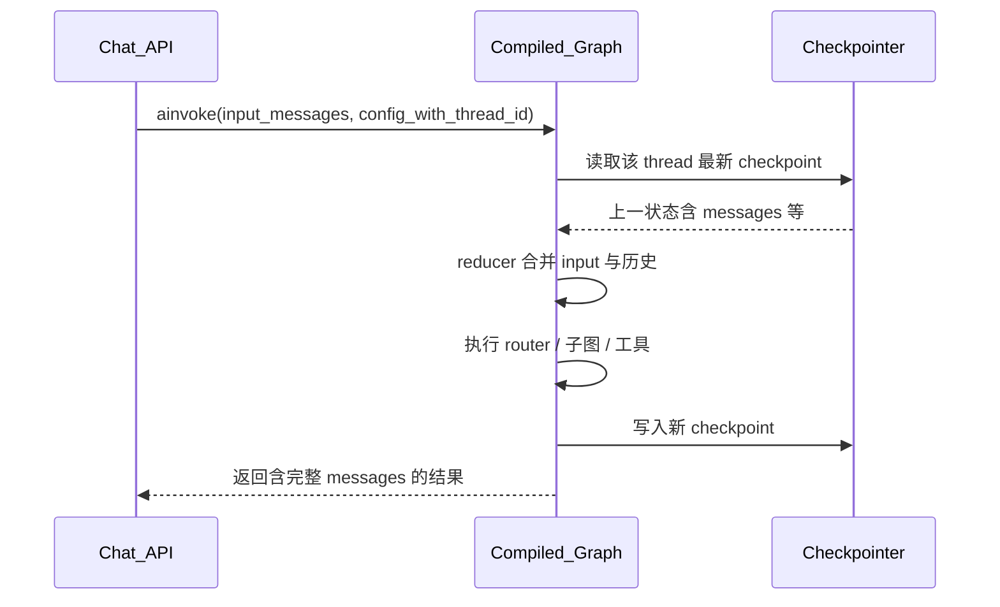

# LangGraph Checkpointer 机制说明（ThetaLab）

本文档说明 **Checkpointer（检查点保存器）** 在 LangGraph 里是什么、解决什么问题，以及在本项目中的具体用法。阅读对象：需要理解「对话为什么能续上」「`thread_id` 是什么」「数据存在哪」的开发者。

---

## 1. Checkpointer 是什么？

在 LangGraph 里，**Checkpointer** 是一个实现了 `BaseCheckpointSaver` 接口的组件。它的职责是：

- **在图的执行过程中**，把当前「状态快照」**持久化**到某种存储（SQLite、PostgreSQL、内存等）；
- **在下一次执行时**，根据配置（主要是 **`thread_id`**）**读回**上次保存的状态，让对话、子图、中断恢复能够延续。

可以把它理解成：**按线程（thread）维度的、带版本的状态数据库**。每次图跑完一步或一个节点，框架都可能写入一条 checkpoint；需要继续跑时，从最新 checkpoint 恢复。

LangGraph 官方文档里常把这种能力称为 **durable execution（持久化执行）** 或 **short-term memory（短期记忆）**——与「跨会话的用户画像」那种长期记忆（Store）区分开。

---

## 2. 为什么需要它？

没有 Checkpointer 时：

- 图的状态只存在于**单次进程、单次调用**的内存里；
- 进程重启、多实例部署、或用户隔一段时间再来，**对话接不上**；
- **Human-in-the-loop（HITL）**：工具执行前暂停等用户确认，也需要把「停在哪一步」记下来，确认后才能 **resume**。

有了 Checkpointer：

| 能力 | 说明 |
|------|------|
| **多轮对话** | 同一 `thread_id` 下，上一轮写入的 `messages` 等 channel 会在下一轮自动参与合并 |
| **可恢复执行** | 中断后从最后一个 checkpoint 继续（例如敏感工具确认后 `astream_resume`） |
| **审计与调试** | 历史 checkpoint 可追溯（视实现与配置而定） |

---

## 3. 它存的是什么？和「消息列表」的关系

编译图时使用 `compile(checkpointer=...)` 后，LangGraph 会在内部把**图的 State**（例如你们的 `AgentState`，含 `messages`、`route` 等）序列化进 checkpoint。

典型结构里会包含：

- **channel_values**：各状态通道的当前值。对 `MessagesState` 来说，最重要的就是 **`messages`**——即当前线程里累积的 `HumanMessage`、`AIMessage`、`ToolMessage` 等；
- **metadata**：如 `thread_id`、checkpoint id、父 checkpoint 等（具体字段依 LangGraph 版本与实现而定）。

**要点**：你们业务代码里每次只传入「本轮用户新消息」，但 **Checkpointer 里保存的是合并后的完整状态**；框架负责把新输入与历史 checkpoint 做 **reducer 合并**（对 `messages` 一般是追加），而不是由业务手动维护整条列表。

---

## 4. ThetaLab 里如何创建与注入？

### 4.1 工厂与后端

项目在 [`backend/agent/persistence/__init__.py`](../backend/agent/persistence/__init__.py) 里通过环境变量 **`PERSISTENCE_BACKEND`**（默认 `sqlite`）选择后端，并暴露：

```python
async def create_checkpointer(**kwargs) -> BaseCheckpointSaver
```

SQLite 实现在 [`backend/agent/persistence/sqlite.py`](../backend/agent/persistence/sqlite.py)：

- 使用 **`AsyncSqliteSaver`**（`langgraph.checkpoint.sqlite.aio`）；
- 数据库文件路径：**`data/checkpoints.db`**（相对仓库根目录的 `data/` 目录）。

PostgreSQL 后端在 [`backend/agent/persistence/postgres.py`](../backend/agent/persistence/postgres.py) 中可选注册（需安装对应依赖），接口与 SQLite 一致，便于将来切换生产存储。

### 4.2 应用启动时注入 Agent

在 [`backend/app.py`](../backend/app.py) 的 `get_agent()` 中：

```python
store = create_store()
checkpointer = await create_checkpointer()
_agent = ThetaLabAgent(store=store, checkpointer=checkpointer)
```

`ThetaLabAgent` 构造时接收 `checkpointer`，在 [`GraphBuilder.build()`](../backend/agent/graph_builder.py) 里传给：

```python
return builder.compile(checkpointer=checkpointer, store=store)
```

因此：**Checkpointer 绑定在「编译后的图」上**；`store` 是另一套 API（长期记忆），见下一节。

---

## 5. Checkpointer 与 Store 的区别（不要混）

| 维度 | **Checkpointer** | **Store**（本项目 `SqliteStore`） |
|------|------------------|-------------------------------------|
| **用途** | 图执行状态、对话消息、恢复点 | 跨线程的用户画像等键值数据 |
| **典型 key** | 由 `thread_id` + 框架内部 id 管理 | 命名空间如 `("profiles", user_id)` |
| **本项目文件** | `data/checkpoints.db` | `data/store.db` |
| **LangGraph API** | `compile(checkpointer=...)` | `compile(..., store=...)` |

一句话：**Checkpointer = 这条聊天线程跑图时的状态；Store = 用户级长期资料。** 两者都是官方持久化能力，但语义不同。

---

## 6. `thread_id` 与 `config`

调用 Agent 时通过 **`config["configurable"]["thread_id"]`** 指定线程，例如 [`backend/agent/agent.py`](../backend/agent/agent.py)：

```python
config = {"configurable": {"thread_id": thread_id}}
result = await agent.ainvoke(
    {"messages": [{"role": "user", "content": message}]},
    config=config,
)
```

- **相同 `thread_id`**：共享同一条对话历史（同一 checkpoint 链）；
- **不同 `thread_id`**：互不相干，相当于新开会话。

默认值常为 `"default"`，前端若按会话切换 `thread_id`，即可实现多会话隔离。

---

## 7. 一次调用里数据怎么流动（简化）



你们从 **API 只传本轮用户消息**；**历史来自 Checkpointer + 框架合并**，无需手写「把旧消息拼进列表」。

---

## 8. 如何读取对话历史（调试与前端）

[`backend/agent/memory.py`](../backend/agent/memory.py) 中的 `get_history` 使用：

```python
state = await checkpointer.aget(config)
messages = state["channel_values"].get("messages", [])
```

把 checkpoint 里的 `messages` 转成 `{role, content}` 列表供前端展示。注意：**这里读的是持久化状态**；若你们在节点里对「发给模型的消息」做了摘要（例如 `summarize_if_needed`），**摘要只影响当次 LLM 输入**，除非另行写回 state，否则 checkpoint 里仍可能是完整原始消息——具体以你们实现为准。

---

## 9. 中断与恢复（HITL）

当子图配置了 `interrupt_before` 等策略时，执行会在某节点前**暂停**，当前状态会落在 Checkpointer 里。用户确认或取消后，使用同一 `thread_id` 调用 **`astream_resume`**（见 `ThetaLabAgent`），图从上次 checkpoint 继续，而不是从头跑。

这依赖 **同一 Checkpointer + 同一 thread_id**；若清库或换库且未迁移，恢复会失败或变成新会话。

---

## 10. 运维与扩展建议

1. **备份**：生产环境应备份 `checkpoints.db`（或 Postgres 中对应表），否则用户对话无法恢复。
2. **扩展多实例**：多进程/多机共享同一 Checkpointer 存储后端时，需使用支持并发的实现（如 Postgres），避免多写 SQLite 文件锁问题。
3. **与 `.cursorrules` 对齐**：项目约定短期记忆用 Checkpointer、长期画像用 Store；升级到 **`PostgresSaver` / `PostgresStore`** 时，保持「只换工厂实现、不改业务图逻辑」的注入方式即可。

---

## 11. 参考与术语

- LangGraph 文档中的 **Persistence / Checkpointer / Memory** 章节（以当前版本为准）。
- 接口抽象：`langgraph.checkpoint.base.BaseCheckpointSaver`。
- 本项目实现入口：[`backend/agent/persistence/`](../backend/agent/persistence/)，`ThetaLabAgent` 与 [`GraphBuilder`](../backend/agent/graph_builder.py)。

---

*文档版本：与仓库内 ThetaLab 代码结构一致；若升级 LangGraph 大版本，请以官方迁移说明为准核对 checkpoint 格式与 API。*
